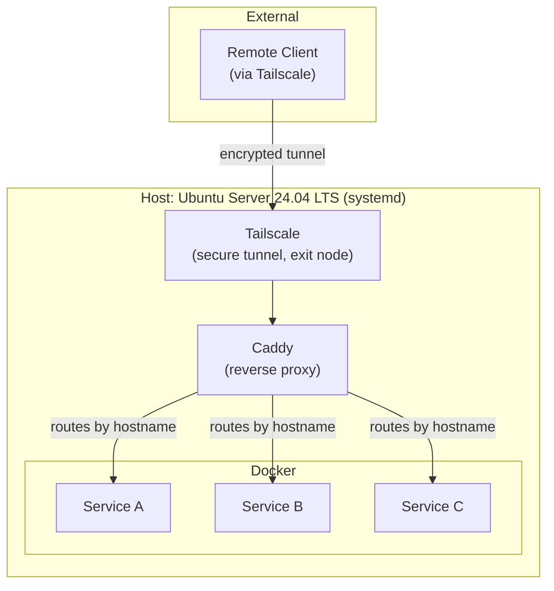

# homeserver-ejr

A local Linux server configured for containerized and versioned software development and education. Built on Ubuntu Server 24.04 LTS with Tailscale for secure remote access, Caddy as a reverse proxy, and Docker for containerized development environments.

## Stack

- **OS:** Ubuntu Server 24.04 LTS (systemd)
- **Remote Access:** Tailscale (encrypted tunnel, exit node)
- **Reverse Proxy:** Caddy (hostname-based routing to containerized services)
- **Containerization:** Docker

## Architecture

A remote client connects over an encrypted Tailscale tunnel directly into the host — no ports are exposed to the public internet. Caddy receives the request and routes it by hostname to the appropriate containerized service, decoupling what a client asks for (a hostname) from where it actually runs (an internal port on a given container). As services are added or changed, only Caddy's routing configuration needs to update; the access path stays the same.

This reflects a defense-in-depth design: each layer enforces its own boundary independently, so no single point of failure exposes the system.

- **SSH** is hardened (key-based auth only, password auth disabled) as the baseline access control.
- **Tailscale** replaces a traditional exposed network perimeter with a private, encrypted mesh — the host is unreachable without being on the tailnet.
- **Caddy** ensures containerized services are never directly addressable, even from within the tailnet, except through controlled hostname-based routes.

A compromise at any one layer still leaves the others intact.

## Hardware

Running on a Beelink EQi13 Pro, selected for its power efficiency relative to similarly-priced/performing alternatives — a meaningful factor for a server intended to run continuously — and its compact form factor, suited to a "two suitcase" relocation lifestyle. The model also supports easy, cost-effective storage upgrades, allowing capacity to grow alongside the container catalog without requiring new hardware.

## Overview

Containerized development environments for local and remote use. Sensitive credentials and environment files are excluded via `.gitignore` and mounted at runtime rather than baked into images.

